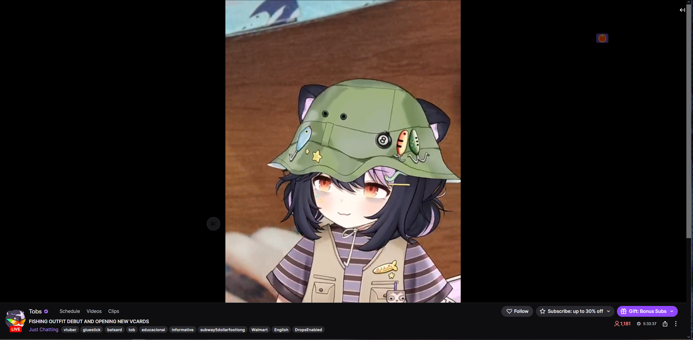
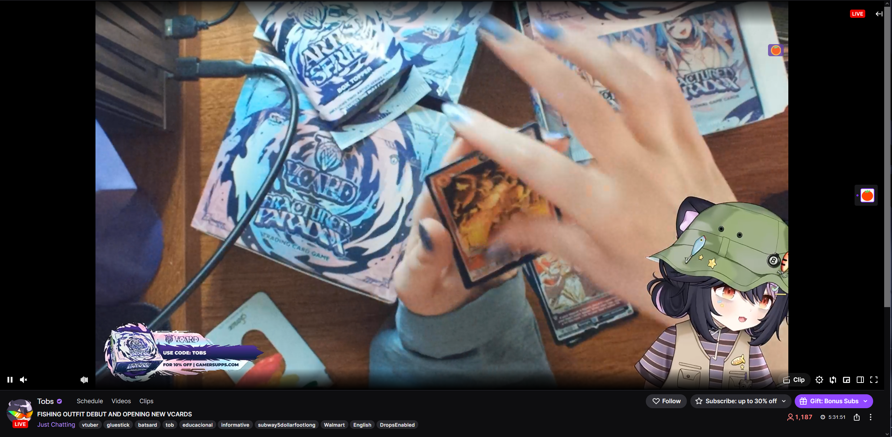

# Twitch Cropper

A Firefox extension that crops a Twitch stream or VOD down to just the part of
the picture you care about — drawn with a simple drag — and can loop a segment
of a VOD or clip.



Submitted to addons.mozilla.org; this repository is its source.

- **Off until you switch it on.** A Twitch page loads completely untouched —
  nothing applied, no extra UI. The toolbar button (or `Alt+Shift+C`) turns it on.
- **Numbers are remembered; switches are not.** Each channel keeps its crop
  rectangle and each video its loop times, but cropping, looping, unloading chat
  and popping out all start **off**, and are switched on by hand.
- **Crop by dragging.** Click *Select region*, drag a box over the player, done.
  By default the player is re-shaped to the crop so you see **all** of it; switch
  to *Fill player* if you'd rather the crop fill the player and trim the overhang.
- **Native quality.** The crop is done with a CSS transform on the real
  `<video>` element. No re-encoding, no downscaling, no canvas — you see exactly
  the pixels Twitch sends.
- **Works on live streams, VODs and clips**, in normal, theatre and full-screen
  modes.
- **Remembers per channel** (VODs/clips fall back to per-video), so a streamer's
  crop comes back automatically next time.
- **Loop a segment** on VODs and clips: set a start and stop time and it jumps
  back to the start each time it reaches the stop (optionally a fixed number of
  times).
- **Unload chat** to take the whole chat column out of the page. Twitch's own
  hide button only *hides* it, leaving it mounted and running.
- **A crop-shaped window** — opens Twitch's player-only view in a clean window
  sized to your crop, with no address bar and no site chrome.
- **Reset everything** with one button in the panel footer.
- **Keyboard shortcuts:** `Alt+Shift+P` shows/hides the panel, `Alt+Shift+C`
  turns the whole extension on/off. Both are re-bindable in `about:addons` → gear →
  *Manage Extension Shortcuts*.
- No network access, no analytics, nothing leaves your browser except the
  settings stored locally by Firefox.

## Install (development)

Firefox 140 or newer.

1. Open `about:debugging#/runtime/this-firefox`.
2. Click **Load Temporary Add-on…**.
3. Pick `manifest.json` in this folder.

Temporary add-ons disappear when Firefox restarts. To load it permanently you
need to package and sign it (see below), or use `web-ext`.

With [web-ext](https://extensionworkshop.com/documentation/develop/getting-started-with-web-ext/):

```sh
web-ext run          # launches Firefox with the extension loaded
web-ext build        # produces a .zip you can sign on addons.mozilla.org
```

## Using it

Twitch Cropper is **off by default**: while it is off, a Twitch page is
completely normal, with nothing applied and nothing added to it. Turn it on with
the **toolbar button** (or `Alt+Shift+C`); the panel opens and a small ✂ button
appears bottom-right. Turning it off again removes everything immediately.

Settings are remembered per channel and per video, so once it is switched on your
crop and loop come back.

**Cropping**

1. Click **Select region…**
2. Drag the rectangle you want to keep. The rest is dimmed while you drag.
   Press `Esc` to cancel.
3. That's it — the region now fills the player.
4. Choose the fit behaviour:
   - **Fit crop** (default) — the whole crop is shown and the player takes the
     crop's shape, with black bars where it doesn't reach. A portrait webcam
     crop gives you a tall player; nothing is cut off.
   - **Fill player** — the crop fills the player and any overhanging edges are
     trimmed. The panel says "overhanging edges trimmed" when that applies.
5. Fine-tune with the `X / Y / Width / Height` boxes, quick presets
   (Left / Right / Top / Bottom / Centre), or turn cropping off with the
   *Cropping on* switch.

Settings save automatically for the current channel (or VOD/clip). *Clear* in the
panel footer forgets them.

**Looping a VOD or clip**

1. Open a VOD (`twitch.tv/videos/…`) or a clip.
2. In the **Loop** section, type a start and a stop as `hh:mm:ss` (or `mm:ss`,
   or plain seconds), or click *Start = now* / *Stop = now* to grab the current
   playback position.
3. Switch **Loop a segment** on. Playback plays the segment and jumps back to the
   start each time it reaches the stop.
4. *Max loops* limits how many times it repeats (`0` = endlessly). When the last
   loop finishes it **stops there** by default; tick *Continue after max loops* to
   keep playing past the stop point instead. *Jump to start* rewinds on demand.

The stop time is optional: leave it blank to loop from the start to the end of
the video.

**Unloading chat**

Twitch's own hide-chat button is purely visual — the chat component stays mounted
and its messages stay in the DOM. The panel's **Chat → Unload chat** button
instead detaches the whole chat column from the document, which removes it (and
roughly 80% of the page's DOM nodes) and stops it being laid out and painted.
**Load chat** puts it back. It is a plain manual toggle and is never remembered,
so a freshly loaded page always has chat exactly as Twitch made it.

It cannot close Twitch's connection to chat — only Twitch can unmount its own
component — so treat this as a rendering/CPU saving, not a full teardown. If the
chat ever comes back empty, press **Load chat** and, if needed, reload the page.

**Popping out a crop-shaped window**

**Crop → Pop out cropped window** moves *the tab you are on* into a small
chrome-less window showing only the cropped player, sized to the shape of your
crop so the stream fills it with no letterbox bars. Nothing is left behind: the
tab **moves** rather than a second window appearing, so if it was the only tab,
the old window closes by itself.

The window is created through the extension APIs (`windows.create` with
`type: "popup"`), which is the only way to get a window with **no address bar** —
a web page is not allowed to hide it. It is Twitch's own player-only view, so
playback, quality and ads behave normally.

The **✕ Close** button in the top-right moves the tab back into a normal window
(when you have one open) and restores the ordinary Twitch page, so you end up
exactly where you started.

**Reset**

The **Reset** button in the panel footer wipes everything the extension has
stored — every channel's crop, every video's loop, the chat preference and the
window positions — switches it off and puts the page back to normal. It asks
*Sure?* first; click again within a few seconds to confirm.

## How the crop actually works

Twitch's player is a `<video>` element inside a container that is exactly the size
of the picture and already clips its overflow. To crop, the extension:

1. puts a marker attribute on the video and sets a few CSS custom properties on
   `<html>`, and
2. lets an injected stylesheet apply `clip-path` and
   `transform: translate(…) scale(…)` with the origin at the centre of your
   selected region.

The scale factor is `min(boxW/regionW, boxH/regionH)` in **Fit** mode (the whole
region is shown, centred, letterboxed on the long axis) or `max(…)` in **Fill**
mode (the region fills the player and the overhang is cut). The `clip-path` is
resolved in the video's own coordinates *before* the transform, so it describes
your crop rectangle exactly, and the player's background is forced black so the
letterbox bars are clean. Because it is a pure compositing operation, quality is
identical to the uncropped stream.

### A note on "without rendering the rest"

A web page can only crop what it *paints*; the browser still decodes the full
frame, because Twitch serves one encoded video and there is no way to decode only
a sub-rectangle without re-muxing the stream (which would break Twitch's player).
The crop therefore costs essentially nothing extra on the GPU, but it is not a
reduction in decode work. Genuinely decoding less would mean a canvas pipeline
that re-encodes every frame, which would lower quality, burn CPU, and break on
DRM-protected content — so this extension deliberately doesn't do that.

## Limitations

- **Looping is VOD/clip only**, by design. Live streams are a moving target and
  Twitch already offers its own rewind; the loop controls are disabled there and
  cropping still works normally.
- The crop only changes what you see, not what's downloaded.
- If Twitch changes its player markup, the selector constants live in
  `src/core.js` (`TC.pageInfo`, `TC.domChannel`, `pickVideo`/`contentBox`) and the
  marker attributes are `data-tc-target` / `data-tc-crop`.

## Development

No build step: the extension **is** the source. Load `manifest.json` as a
temporary add-on, or `web-ext run`.

```sh
node test/run.mjs      # all six suites, no dependencies
npx web-ext lint       # must report 0 errors, 0 warnings
npx web-ext build      # writes web-ext-artifacts/twitch_cropper-<version>.zip
```

`test/` needs no dependencies: `node test/run.mjs` runs six suites covering time
parsing and the crop geometry, the loop state machine, chat unload, the panel's
DOM structure, and the popout. `test/fuzz.test.js` throws NaN, Infinity, null,
strings and out-of-range values at the pure functions and asserts invariants
only, so a failure is reproducible by iteration index.

## Privacy

Twitch Cropper collects and sends nothing. It contains no networking code at
all — no `fetch`, no `XMLHttpRequest`, no `WebSocket` — and no analytics, no
accounts and no server of ours. The crop you choose for a channel and the loop
times you choose for a video are stored locally by Firefox and never leave your
computer; the panel's **Reset** button clears them.

The manifest declares this as `data_collection_permissions.required: ["none"]`.

## Screenshots

| | |
|---|---|
|  |  |
| the ordinary 16:9 view | cropped to the webcam |
|  |  |
| popped out into its own window | the panel |

Screenshots are from the channel **Tobs** — thanks, Tobs!

## License

MIT — see [LICENSE](LICENSE).

Not affiliated with Twitch Interactive, Inc.

## Files

```
manifest.json         Firefox MV3 manifest
LICENSE               MIT
LISTING.md            the addons.mozilla.org listing text
REVIEWERS.md          background for Mozilla's reviewers
web-ext-config.cjs    web-ext lint/build configuration
src/core.js           namespace, storage, page/video discovery, crop engine
src/chat.js           chat unload / load
src/loop.js           VOD/clip segment looping
src/panel.js          Shadow-DOM panel, launcher button, drag-to-select overlay
src/main.js           bootstrap, SPA navigation, resize/reconcile, popout
src/background.js     toolbar button, shortcuts, and the popout window
src/styles.css        the single rule that applies the crop transform
test/                 six suites and their runner
icons/icon.svg
```
